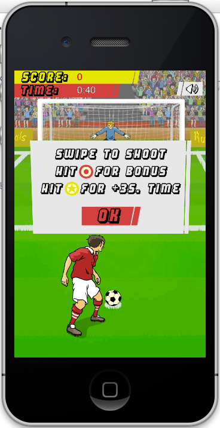
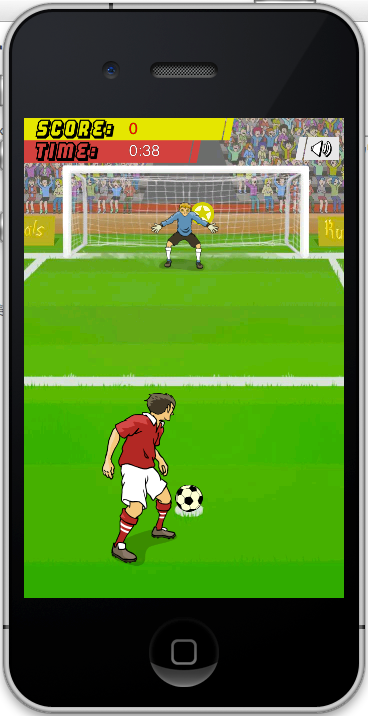

巴西十二码
===

### 简介
基于Cocos2d-x 3.0 + SpriteBuilder 1.x + spritebuilder_cocos2dx/spritebuilder_1.1_beta1 开发的足球射门游戏  
cocos2d-x 3.0及spritebuilder_cocos2dx代码需要另行下载，不包含在这个代码中

### 状态
开发中

### 免责说明
游戏中使用的美术、音乐资源来源于网上，如有侵权，请告知我们删除  

### 游戏截图

